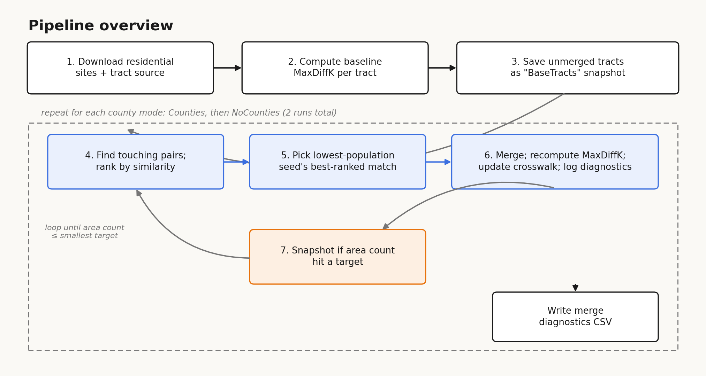
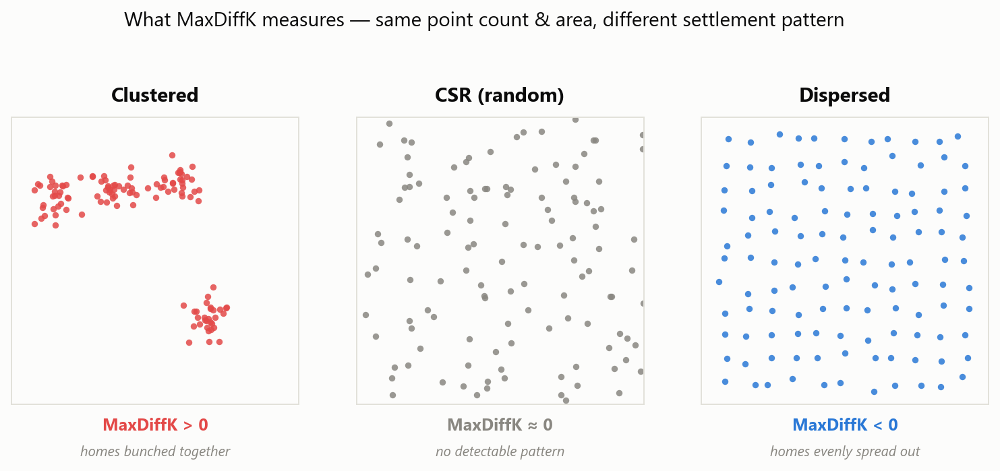
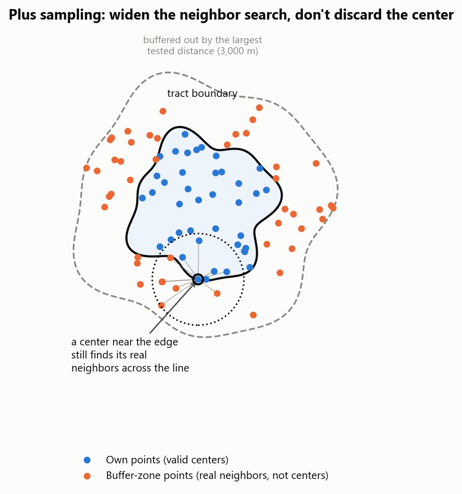
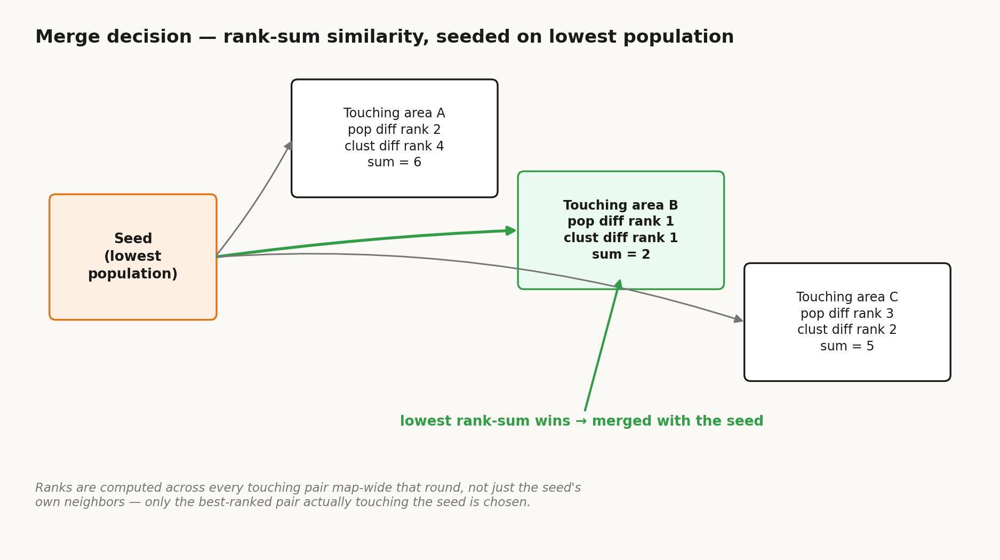
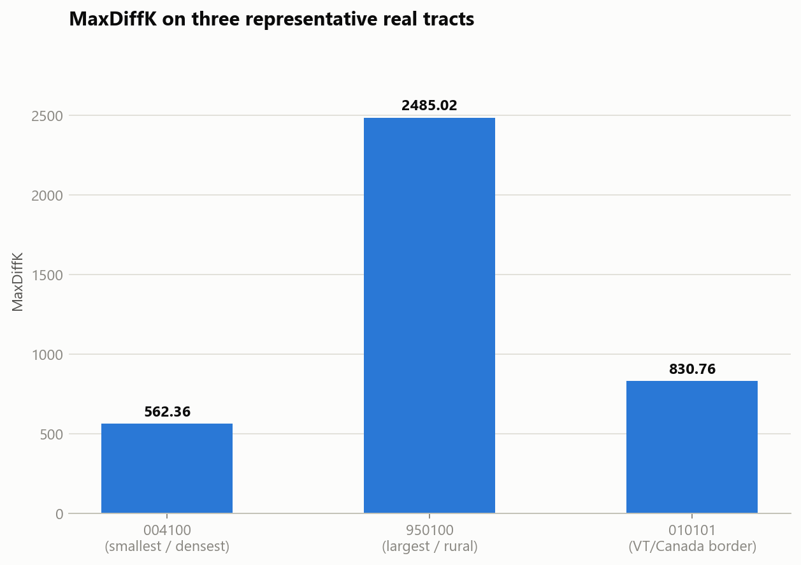

# Subcounty Areas — Technical Documentation

---

## 1. Purpose

Aggregates census tracts into "subcounty areas" — a geography coarser than a tract, finer
than a county — using only two signals: total population and a residential
clustering pattern (`MaxDiffK` - based on Ripley's K, §3). Anchoring on those rather than on any specific social
or economic indicator keeps the result usable as a general-purpose geography.

Starting from every original tract, the script repeatedly merges the current
lowest-population area into its most similar *touching* neighbor, until the map reaches a
target area count. It runs this twice:

- **Counties** — a merge may never cross a county line.
- **NoCounties** — any two touching areas may merge, county lines included.

Each run is snapshotted every time the area count passes through one of
`AGGREGATION_TARGET_COUNTS = [60, 100, 150]` (or the closest count it actually
reaches, §3.5). These counts are near equal-interval distances between the Vermont
county count (14) and the Vermont census tract count in 2020 (193).

### Requirements

```
pip install geopandas shapely pyproj requests scipy numpy pandas
```

```
python SubcountyAreas.py
```

As shipped, both data sources default to Vermont (VCGI's 2020 census tract layer and E911
site/structure layer) — the merge logic itself is not Vermont-specific. To aggregate a
different state, edit `TRACT_SERVICE_URL`/`RESIDENTIAL_SITES_SERVICE_URL`, their matching
field names, `PROJECTED_CRS_EPSG`, `NEIGHBORHOOD_DISTANCES_METERS` if you would like a 
different definition for what a neighborhood range is, and `AGGREGATION_TARGET_COUNTS` (§4.1), 
since the last two were tuned to Vermont's scale.

Output lands at `~/Desktop/SubcountyAreas/SubcountyAreas.gpkg`, with a merge log at
`~/Desktop/SubcountyAreas/SubcountyAreas_MergeDiagnostics.csv`.

---

## 2. Pipeline overview



| Step | What | Why |
|---|---|---|
| 1. Download & filter | Pull residential site points and the tract source from ArcGIS REST, reprojected to one projected CRS in meters. Keep only `Category = 'Residential'` sites; treat a unit count of 0 as 1. | Residential structures proxy for where people live. A unit count of 0 almost always means missing data, not zero housing. |
| 2. `MaxDiffK` per tract | Weighted Ripley's K/L across six distances (500–3000 m), collapsed to whichever value deviates furthest from pure randomness (sign included). | Raw density mostly just reflects how a tract was originally drawn (tracts equalize population, not area). Ripley's K measures clustering independent of that. |
| 3. Merge loop | Each round: find every touching pair, rank by combined population + `MaxDiffK` similarity, merge the current lowest-population area with its best-ranked own neighbor. | Guarantees the population floor is addressed every round. Ranking pairs map-wide, rather than normalizing each pair's difference by the map-wide total, means one extreme pair elsewhere on the map can't inflate the shared denominator and shrink every other pair's normalized score toward zero. |
| 4. Crosswalk | Track original tract → current area ID, updated on every merge. | Lets any tract-level statistic be re-aggregated later from source data. |
| 5. Snapshot | Save area boundaries + crosswalk whenever the area count matches a target. | Produces several aggregation levels. |
| 6. Diagnostics | Log each merge's population/clustering difference and where it ranked against every pair available that round. | Makes the cost of seeding on population (occasionally forcing a mediocre `MaxDiffK` match) directly measurable. |

---

## 3. Step by step

### 3.1 Download & filter

`fetch_feature_server_as_geodataframe` pages an ArcGIS REST `/query` endpoint until a page
comes back short, and reprojects everything to `PROJECTED_CRS_EPSG` via the server's own
`outSR` parameter. Used for both the residential-site layer and the tract layer.

`prepare_datasets` downloads both, filters sites to `Category = 'Residential'`, and cleans
`ResUnitCnt` (`NaN → 0`, then `0 → 1`). The cleaned points are indexed once
(`shapely.STRtree`) alongside parallel coordinate/weight arrays (`ResidentialSites`), reused
for every `MaxDiffK` computation that follows.

### 3.2 The residential clustering signal — weighted Ripley's K/L (`compute_max_diff_k`)



Raw density (population ÷ area) mostly encodes how a tract was originally drawn, not how
people are actually distributed within it. Ripley's K asks a scale-independent question
instead: *are homes more clustered, or more spread out, than pure chance would produce?*

```
K(d) = (1 / λ) · weighted # of other points within distance d of a typical point
L(d) = sqrt(K(d) / π)     # L(d) = d under complete spatial randomness (CSR)
diffK(d) = L(d) - d       # 0 under CSR; >0 clustered, <0 dispersed
```

`diffK` is evaluated at six distances (`NEIGHBORHOOD_DISTANCES_METERS`), and whichever
single value has the largest magnitude (sign kept) becomes `MaxDiffK`. Areas with fewer
than 3 residential sites return `0.0`. In practice, this will only trip in tracts that 
are strange, like airports. No residents present.

**Edge correction — plus sampling.** Counting neighbors only inside the tract would
undercount points near the boundary. Instead:



1. Every site intersecting the tract is used as a center — none discarded near the edge.
2. Their neighbor counts are drawn from a **wider region**: the tract buffered outward by
   the largest tested distance (3000 m).
3. The baseline "random" intensity (`λ`) is also estimated from that same wider buffer, not
   from the tract's own density — using the tract's own density would extrapolate a small,
   locally-dense tract's density out to 3 km, reading it as spuriously dispersed.

**Limitations:** at the outer edge of the downloaded site data (a state boundary), there's
no data across the line to correct with — real, unavoidable edge effect there. And
`MaxDiffK` always scores tracts against *present-day* residential locations, regardless of
which vintage `TRACT_SERVICE_URL` points at — worth noting before pairing this script with
historical tract geometry.

### 3.3 Lowest-population-seed merge (`find_touching_area_pairs`, `rank_candidates_by_similarity`, `select_lowest_population_seed`)



Each round:

1. Build a fresh `STRtree` over current areas, find every touching pair
   (`predicate="touches"`), dropping cross-county pairs in `Counties` mode.
2. Rank every pair map-wide on two measures independently — population-difference rank,
   `MaxDiffK`-difference rank — and sum the two ranks (`similarity_score`; lower = more
   similar).
3. Take the current lowest-population area with at least one viable neighbor as the
   round's **seed** (`select_lowest_population_seed`). An area with no viable neighbor is
   skipped for that round only — no persistent exclusion list.
4. Merge the seed with whichever of *its own* touching neighbors ranks best on the
   map-wide scale from step 2.

**Why seed on population?** Picking whichever touching pair anywhere ranked best each round
would never force attention to a specific area — a low-population outlier whose neighbors
are all dissimilar could be passed over indefinitely. Seeding on the population floor
guarantees it's addressed every round; the cost is that the seed sometimes has no choice but
a mediocre `MaxDiffK` match, which is exactly what the diagnostics (§3.6) measure.

**Why rank instead of normalizing by the map-wide total?** Dividing each difference by the
sum of all differences that round lets one extreme pair (e.g. a huge rural tract touching a
small dense one) compress every other pair's share toward zero, erasing real differences
between two pairs actually being compared. Rank position isn't affected by another pair's
magnitude, so it can't be distorted that way. Ties get fractional (average) ranks.

### 3.4 Crosswalk (`build_initial_areas_and_crosswalk`, `apply_merge`)

`tract_crosswalk` has one row per **original** tract, forever — only its `ClusterID` column
changes, to whichever ID absorbed it (`merged_cluster_id = min(id_a, id_b)`, compared as
strings). Population is summed and county labels combined (`combine_county_values`) on
every merge, but nothing about an original tract's own data is discarded except `MaxDiffK`
— which is recomputed fresh on the merged shape (§3.2), never approximated from its parts.

### 3.5 Snapshotting, and unreachable targets (`run_hierarchical_merge`, `save_snapshot`)

Before any merging, the untouched tracts are saved as a `BaseTracts` layer — the original
tract count is always above the largest target, so it would otherwise never appear in the
output. From there, each snapshot is two objects in the shared GeoPackage: a spatial layer
`Subcounty{county_mode}{count}` (`ClusterID`, `ClusterPopulation`, `COUNTY`, `MaxDiffK`) and
a non-spatial `{layer_name}_Crosswalk` table.

Every merge drops the area count by exactly 1, so a run either lands on a target exactly or
stalls above it. A `Counties`-constrained run can stall — nothing guarantees the remaining
areas stay mutually reachable once merges are restricted within a county (this is more
likely there, though `NoCounties` isn't structurally immune either, e.g. tracts on an
island with no land border to the mainland). When `find_touching_area_pairs` comes back
empty short of a target, that state is snapshotted anyway, labeled with the count actually
reached, as the stand-in for every smaller target that run can no longer reach.

### 3.6 Merge diagnostics (`build_merge_diagnostic_record`)

For every merge, before narrowing to the seed's own neighbors, the full map-wide ranking
is already available — exactly what a map-wide best-match rule would have chosen from
instead. Each row of `SubcountyAreas_MergeDiagnostics.csv` records the chosen pair's
`population_difference`, `clustering_difference`, and `similarity_score`, plus each one's
**percentile** against every pair available that round (including the chosen pair itself):

```python
clustering_difference_percentile = (all_clustering_diffs < chosen.clustering_difference).mean() * 100
```

A `clustering_difference_percentile` of 90 means 90% of all pairs available anywhere on the
map that round were a *better* `MaxDiffK` match than the one the seed was forced into.
Percentile rather than a fixed threshold keeps this meaningful round to round, since what
counts as a "big" difference varies with how similar the whole map happens to be that
round.

---

## 4. Reference

### 4.1 Configuration

| Constant | Value | Meaning |
|---|---|---|
| `OUTPUT_GEOPACKAGE_PATH` | `~/Desktop/SubcountyAreas/SubcountyAreas.gpkg` | Every snapshot from every run is a separate layer/table inside this one file. |
| `MERGE_DIAGNOSTICS_CSV_PATH` | `~/Desktop/SubcountyAreas/SubcountyAreas_MergeDiagnostics.csv` | One row per merge, across both county modes. |
| `RESIDENTIAL_SITES_SERVICE_URL` | Vermont E911 site/structure points | Every residential structure location statewide. |
| `RESIDENTIAL_CATEGORY_FIELD` / `RESIDENTIAL_CATEGORY_VALUE` | `"Category"` / `"Residential"` | Filters the site layer down to residential structures only. |
| `RESIDENTIAL_UNIT_COUNT_FIELD` | `"ResUnitCnt"` | Per-site weight used in `MaxDiffK`; `NaN`/`0` treated as `1`. |
| `TRACT_SERVICE_URL` | Vermont 2020 census tract polygons | The single tract source this run aggregates. |
| `TRACT_POPULATION_FIELD` | `"P0010001"` | Total-population field on that tract source. |
| `TRACT_ID_FIELD` / `COUNTY_FIELD` | `"TRACT"` / `"COUNTY"` | Source field names expected on the tract source. |
| `COUNTY_MODES` | `["Counties", "NoCounties"]` | Whether merges may cross county lines. |
| `AGGREGATION_TARGET_COUNTS` | `[60, 89, 100, 107, 150]` | Area counts at which a snapshot is taken; the loop stops at `min(...)` (or stalls first — §3.5). |
| `PROJECTED_CRS_EPSG` | `32145` (Vermont State Plane) | Every download is reprojected here so distance/area/perimeter math is in real meters. |
| `NEIGHBORHOOD_DISTANCES_METERS` | `[500, 1000, 1500, 2000, 2500, 3000]` | The six Ripley's K distances tested per area. |

### 4.2 Module layout

```
SubcountyAreas.py
├── CONFIGURATION           service URLs, output paths, tunable constants
├── RECORD TYPES            SubcountyArea, MergeCandidate, ResidentialSites (dataclasses)
├── DATA ACCESS             fetch_feature_server_as_geodataframe, prepare_datasets,
│                           points_within_polygon
├── RESIDENTIAL-STRUCTURE PATTERN MEASURE
│   └── compute_max_diff_k()                the Ripley's K/L statistic (§3.2)
├── HIERARCHICAL MERGE
│   ├── find_touching_area_pairs()
│   ├── rank_candidates_by_similarity()     rank-based scoring (§3.3)
│   ├── select_lowest_population_seed()
│   ├── build_initial_areas_and_crosswalk()
│   ├── save_snapshot()
│   ├── build_merge_diagnostic_record()     §3.6
│   ├── combine_county_values()
│   ├── apply_merge()
│   └── run_hierarchical_merge()            the per-county-mode merge loop
└── MAIN
    └── main()                              fetch → baseline MaxDiffK → BaseTracts →
                                             merge runs → diagnostics CSV
```

`run_hierarchical_merge(tract_geodata, county_mode, residential_sites)` returns the list of
per-merge diagnostic records for that one county mode; `main()` concatenates both modes'
lists before writing the CSV.

---

## 5. Validation

### 5.1 `MaxDiffK` sanity checks

Synthetic checks (no network access): uniform-random points surrounded by a matching-density
exterior center near 0 across repeated draws; a tight synthetic cluster produces a strongly
positive value. Both confirm the statistic reads "no pattern" and "clustered" correctly.

Real-data spot check, three representative Vermont tracts (smallest, largest, and
northernmost by centroid):



| Tract | Residential sites | `MaxDiffK` |
|---|---|---|
| 004100 (smallest, densest) | 278 | 562.36 |
| 950100 (largest, rural) | 2541 | 2485.02 |
| 010101 (VT/Canada border) | 1762 | 830.76 |

All three are sane, non-zero, and correctly signed — including the smallest/densest tract,
which has the least favorable geometry for edge correction (§3.2).

### 5.2 Population equalization

To check the seed-first rule (§3.3) is equalizing population sensibly for a given run:

1. Pull cluster populations at each target count and compute the coefficient of variation
   (CV = SD/mean). A seed-first rule should keep this flat or improving as aggregation
   proceeds, since every round is forced to address whichever area is currently smallest.
2. Confirm no area is left stranded at a near-zero population at any target count, in
   either county mode.
3. Compare against a Monte Carlo null: random partitions of the original tract populations,
   constrained to the same cluster-size structure the algorithm actually produced (same
   number of clusters, same tracts-per-cluster). A working seed-first rule should
   consistently outperform this null.

The `MaxDiffK` trade-off this rule makes — occasionally forcing a seed into a mediocre
match when that's the only neighbor available — isn't a one-time finding; it's measured on
every run via `clustering_difference_percentile` in `SubcountyAreas_MergeDiagnostics.csv`
(§3.6). Aggregating that column (e.g. what fraction of merges landed above the 75th or 90th
percentile of map-wide match quality) gives a concrete, run-specific answer to how often,
and how badly, a seed was forced into a poor match.
